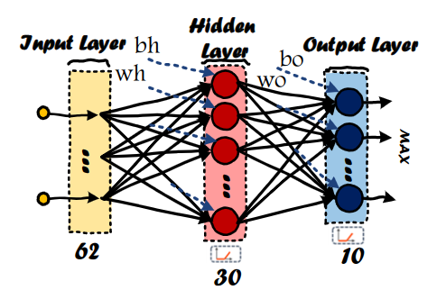

# Multi-Layer Perceptron (MLP) Neural Network

Hardware implementation of a Multi-Layer Perceptron (MLP) Neural Network using Verilog

## Diagram

The MLP Network:

Datapath:

## Simulation Results

Accuracy: 89.87%

